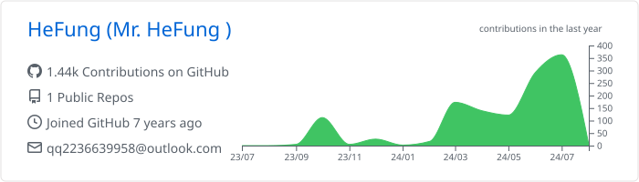
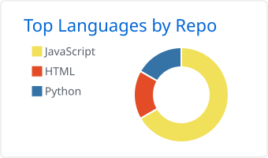
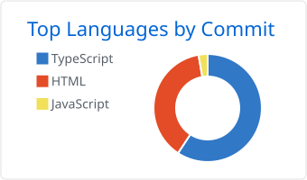
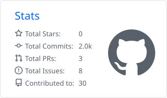
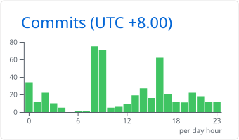
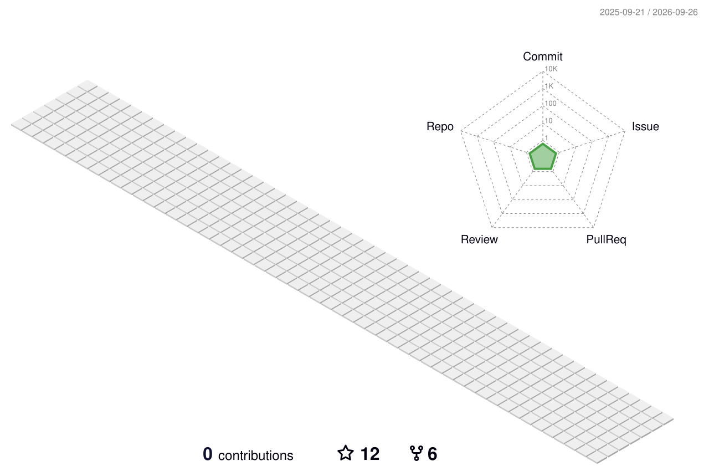

<picture>
  
</picture>

  

- 👨🏻‍💻 专注于前端开发的 Web 开发工程师
- 💻 毕业于计算机专业的业余选手
- 🪐 Self-hosting 爱好者
- 🛡️ Homelab 理性玩家
- 🌽 拥有[域名](https://hefung.github.io)
- 🕸 维护最小的[互联网自治系统](https://www.hefung.github.io)
  
---

## 个人项目： 

[📚 Blog](https://hefung.github.io/) · [📇 Mail](mailto:qq2236639958@outlook.com) · [💬 Discussions](https://github.com/orgs/viptvjs/discussions)

<a href="https://hefung.github.io" target="_blank">
  <picture>
    <source
      media="(prefers-color-scheme: dark)"
      srcset="https://github-readme-status-mrhope.vercel.app/api/pin?username=hefung&repo=hefung.github.io&theme=github_dark"
    />
    
  </picture>
</a>
<a href="https://hefung.github.io/nav" target="_blank">
  <picture>
    <source
      media="(prefers-color-scheme: dark)"
      srcset="https://github-readme-status-mrhope.vercel.app/api/pin?username=hefung&repo=nav&theme=github_dark"
    />
    
  </picture>
</a>
<a href="https://hefung.github.io/bing" target="_blank">
  <picture>
    <source
      media="(prefers-color-scheme: dark)"
      srcset="https://github-readme-status-mrhope.vercel.app/api/pin?username=hefung&repo=bing&theme=github_dark"
    />
    
  </picture>
</a>

## 统计信息

<a href="https://hefung.github.io" target="_blank">
<picture>
  <source
    media="(prefers-color-scheme: dark)"
    srcset="./profile-summary-card-output/github_dark/0-profile-details.svg"
  />
  
</picture>
</a>

<a href="https://hefung.github.io" target="_blank">
<picture>
  <source
    media="(prefers-color-scheme: dark)"
    srcset="./profile-summary-card-output/github_dark/1-repos-per-language.svg"
  />
  
</picture>
</a>

<a href="https://hefung.github.io" target="_blank">
<picture>
  <source
    media="(prefers-color-scheme: dark)"
    srcset="./profile-summary-card-output/github_dark/2-most-commit-language.svg"
  />
  
</picture>
  
<a href="https://hefung.github.io" target="_blank">
<picture>
  <source
    media="(prefers-color-scheme: dark)"
    srcset="./profile-summary-card-output/github_dark/3-stats.svg"
  />
  
</picture>
</a>
  
<a href="https:/hefung.github.io" target="_blank">   
<picture>
  <source
    media="(prefers-color-scheme: dark)"
    srcset="./profile-summary-card-output/github/4-productive-time.svg"
  />
  
</picture>
</a>

## 框架工具:

