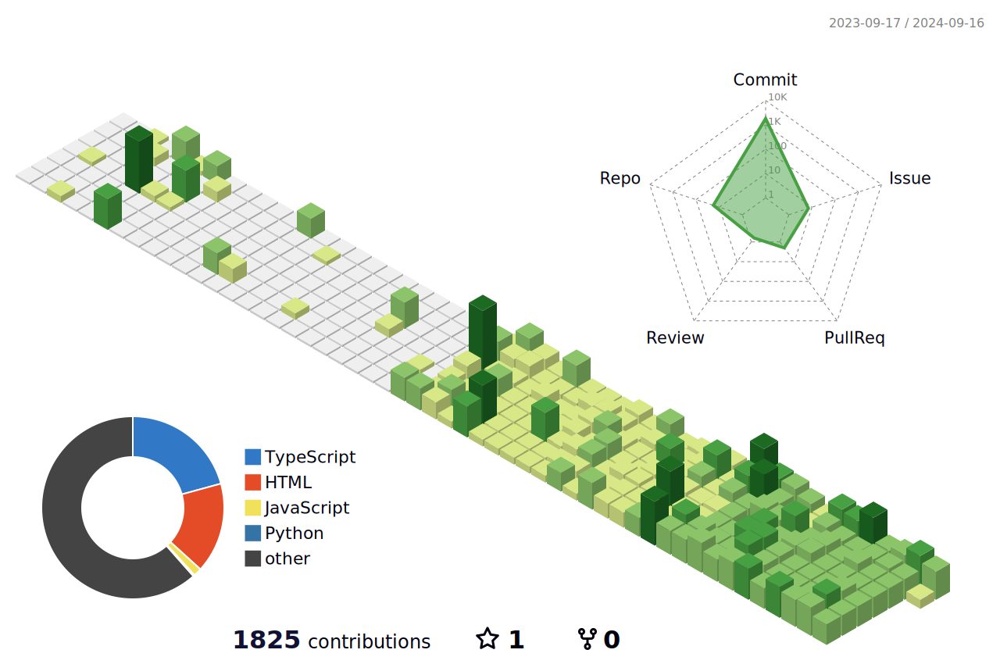

<pre>
 TypeScript enthusiast, Node.js user, Rust & Harmony beginner
</pre>

## 个人项目： 

[📚 Blog](https://www.viptv.work/blog/) · [📇 Mail](mailto:qq2236639958@outlook.com) · [💬 Discussions](https://github.com/orgs/viptv-work/discussions)

<a href="https://www.viptv.work" target="_blank">
  <picture>
    <source
      media="(prefers-color-scheme: dark)"
      srcset="https://github-readme-status-mrhope.vercel.app/api/pin?username=viptv-work&repo=viptv&theme=github_dark"
    />
    
  </picture>
</a>
<a href="https://iptv.vodtv.cn" target="_blank">
  <picture>
    <source
      media="(prefers-color-scheme: dark)"
      srcset="https://github-readme-status-mrhope.vercel.app/api/pin?username=vodtv&repo=iptv-sources&theme=github_dark"
    />
    
  </picture>
</a>

## 统计信息

<a href="https://www.viptv.work" target="_blank">
<picture>
  <source
    media="(prefers-color-scheme: dark)"
    srcset="./profile-summary-card-output/github_dark/0-profile-details.svg"
  />
  
</picture>
</a>

<a href="https://www.viptv.work" target="_blank">
<picture>
  <source
    media="(prefers-color-scheme: dark)"
    srcset="./profile-summary-card-output/github_dark/1-repos-per-language.svg"
  />
  
</picture>
</a>

<a href="https://www.viptv.work" target="_blank">
<picture>
  <source
    media="(prefers-color-scheme: dark)"
    srcset="./profile-summary-card-output/github_dark/2-most-commit-language.svg"
  />
  
</picture>
  
<a href="https://www.viptv.work" target="_blank">
<picture>
  <source
    media="(prefers-color-scheme: dark)"
    srcset="./profile-summary-card-output/github_dark/3-stats.svg"
  />
  
</picture>
</a>
  
<a href="https://www.viptv.work" target="_blank">   
<picture>
  <source
    media="(prefers-color-scheme: dark)"
    srcset="./profile-summary-card-output/github/4-productive-time.svg"
  />
  
</picture>
</a>

## 框架工具:

